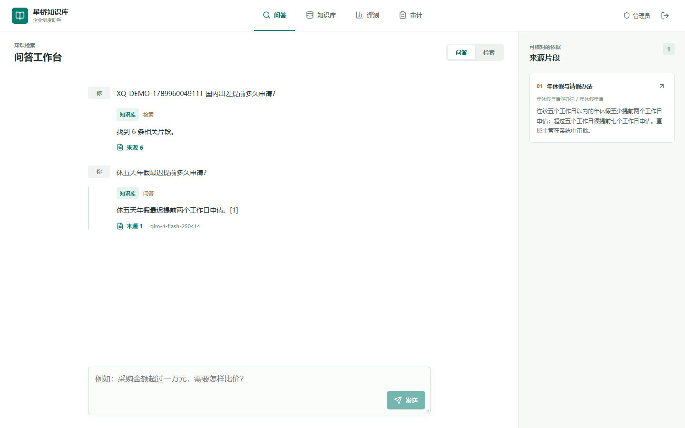
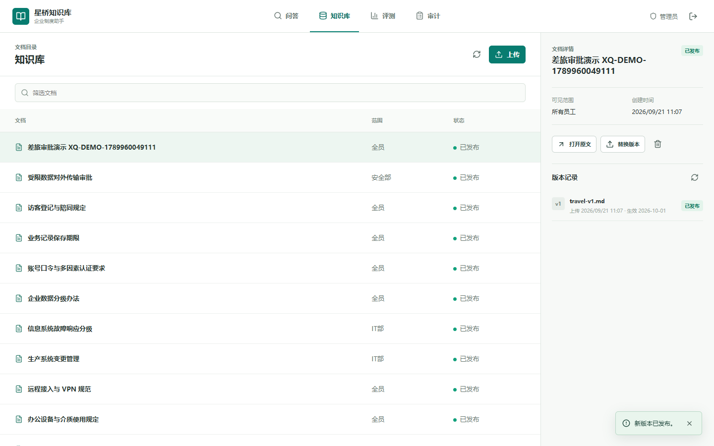
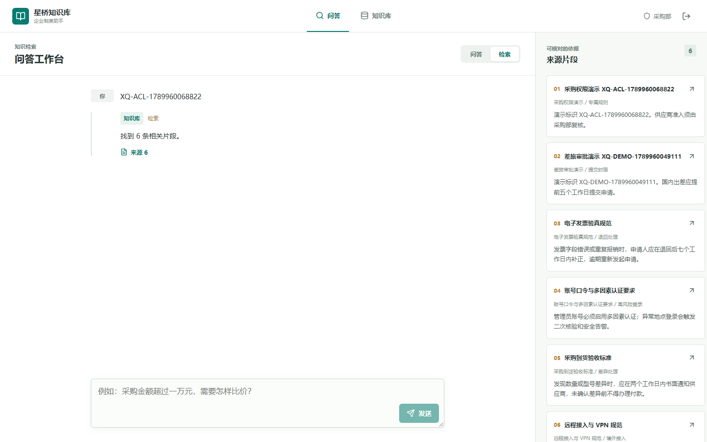
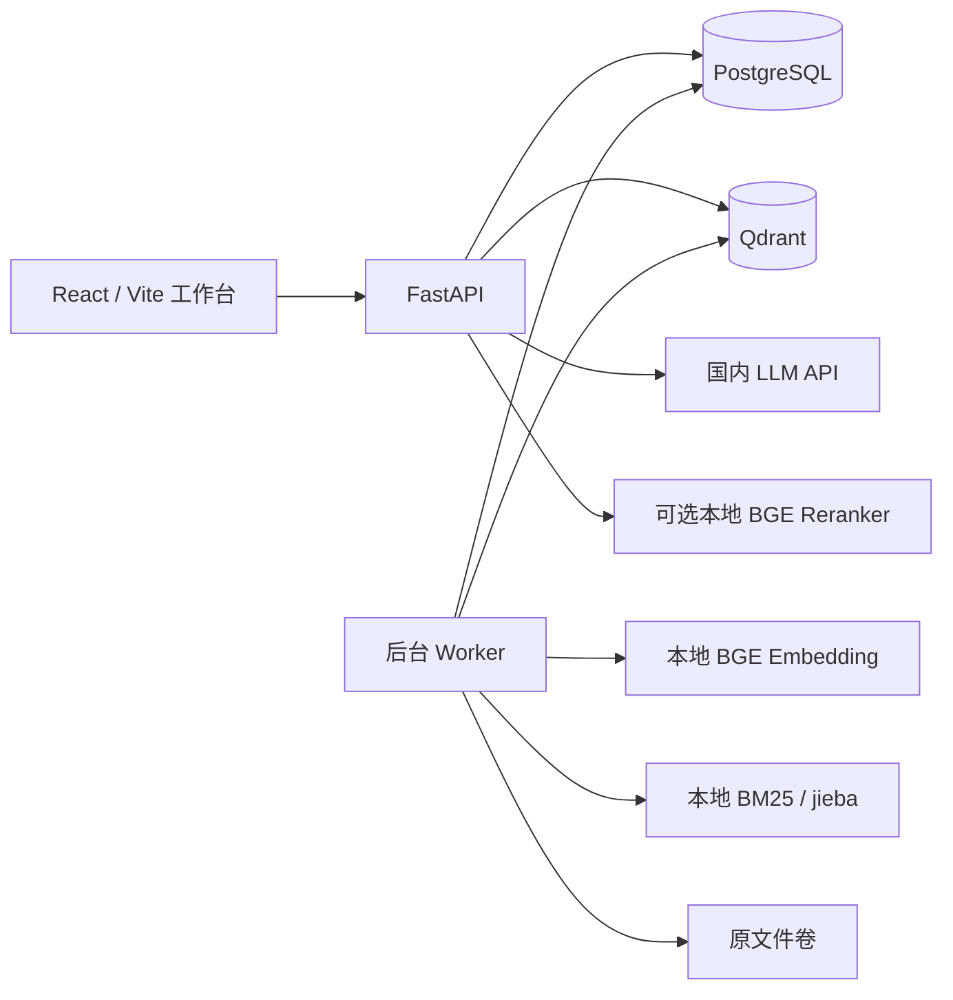

# 企业 RAG 知识库助手

[](https://github.com/zcl-crypto/enterprise-rag-assistant/actions/workflows/ci.yml)
[](LICENSE)
[](pyproject.toml)

一个可本地一键启动、面向生产流程设计的企业知识库作品集项目。系统覆盖多格式解析、混合检索、权限过滤、引用溯源、版本生命周期、真实模型生成和离线评测。场景、企业和制度语料均为虚构；不要上传真实企业机密。

[快速启动](#docker-启动) · [评测结果](#实测结果) · [详细方案](docs/project-plan-zh.md) · [实施记录](docs/progress.md) · [评测报告索引](reports/README.md)



## 核心能力

- **完整 RAG 数据链路**：PDF、DOCX、Markdown、TXT、HTML 统一解析，按字符与 BGE 512-token 上限切块，写入 Qdrant dense 与 BM25 sparse 索引。
- **Hybrid Retrieval**：Dense + BM25 经 RRF 融合，可选 BGE Reranker；离线对照保留指标、延迟和逐题结果。
- **服务端权限控制**：按角色、部门和活跃版本过滤候选，普通员工无法通过前端参数绕过权限。
- **可验证引用**：回答携带编号引用并可打开对应版本原文；版本被替换或删除后，历史引用不会静默指向新版。
- **文档生命周期**：支持上传、异步索引、发布、替换、删除和失败任务重试，先撤销可见性再清理两路索引与文件。
- **工程化交付**：FastAPI + React + PostgreSQL + Qdrant + Worker，提供数据库迁移、Token 额度、审计视图、Docker Compose 和自动化测试。

## 实测结果

| 数据与指标 | 结果 |
| --- | ---: |
| 虚构企业制度 / chunks / 评测题 | 25 / 48 / 110 |
| Dense / Hybrid / Hybrid + Reranker Recall@5 | 1.000 / 1.000 / 1.000 |
| Dense / Hybrid / Hybrid + Reranker MRR | 0.9792 / 0.9938 / 0.9875 |
| 有答案题返回回答并引用全部预期文档 | 73/80（91.3%） |
| 无答案题拒答 | 25/25（100%） |
| 越权文档引用 / 未知来源引用 | 0 / 0 |
| 110 题端到端 p50 / p95 | 3231.21 / 10540.22 ms |

以上来自虚构小规模数据集和自动指标。`73/80` 只表示“返回回答并引用预期文档”，**不是答案正确率**；答案正确性与引用语义支持率仍待独立人工复核。完整口径和逐题结果见 [`reports/`](reports/README.md)。

<p>
  
  
</p>

## 架构



输入支持 PDF 文本层、DOCX、Markdown、TXT、HTML。上传时先做基础格式预检：PDF 文件头、DOCX 必要的 ZIP 条目、文本类 UTF-8 与空字节；明显错格式直接返回 400，不创建版本或遗留文件。该预检不是恶意文件扫描，也不能代替后续深度解析。文档解析为统一结构后切分，写入 Qdrant 的 dense 与 BM25 索引；Hybrid 模式使用 RRF 融合。新版本索引就绪后由管理员发布；删除先撤销可见性，再清理两路索引和原文件。引用打开原文时带上对应 `version_id`；若已被替换或删除，返回 404，而不是静默打开新版。权限以数据库中的活跃版本为准，不能由前端覆盖。

## Docker 启动

需要 Docker Compose、网络连接和足够的模型缓存空间。本机已在 Docker Desktop 4.91.0、Engine 29.8.0、Compose v5.5.1 下完成实机验证：`web`、`api`、`worker`、`postgres`、`qdrant`、`model-init` 和 `db-init` 均可启动，Alembic 实际升级至 `0003`。`db-init` 在 API/worker 启动前执行迁移；已有且结构匹配的旧数据库会登记初始版本，结构不一致时启动失败并要求人工处理。

```powershell
Copy-Item .env.example .env
# 编辑 .env，至少修改 JWT_SECRET 和演示密码
docker compose up --build -d
docker compose ps -a
```

访问 `http://127.0.0.1:8080/`；API 文档在 `http://127.0.0.1:8765/docs`。Compose 默认 `RETRIEVAL_MODE=hybrid`，首次启动会下载本地 Embedding 与 BM25 资源，时间取决于网络。演示账号为 `admin`、`employee`、`procurement`，密码使用 `.env` 中的 `DEMO_PASSWORD`。`procurement` 属于采购部；`employee` 不属于受限部门。不要在对外环境使用样例密码或 JWT 密钥。

空库启动后可从界面逐份上传，也可在已安装项目依赖的宿主机一次性导入 25 份虚构制度：

```powershell
$env:DEMO_PASSWORD = "<你的演示密码>"
.\.venv\Scripts\python -m scripts.seed_corpus --base-url http://127.0.0.1:8765
```

实测导入结果为 25 份活跃文档、48 个 chunk；管理员、普通员工、采购部员工分别可见 25/17/22 份。执行不带 `-v` 的 `docker compose down` 再 `docker compose up -d` 后，PostgreSQL 文档、上传原文和 Qdrant 两路索引均保持不丢失。项目镜像显式安装 CPU 版 PyTorch，不下载 CUDA 运行库。

`ENABLE_RERANKER=1` 可启用约 1.1 GB 的本地 BGE 重排模型；默认关闭。本项目的小样本实测中，重排未优于 Hybrid，且明显增加 CPU 延迟。已有持久化 dense 数据切换到 Hybrid 时，先运行 `docker compose run --rm worker python -m scripts.backfill_lexical` 回填活跃版本；新上传文档会自动写入两路索引。

`LLM_DAILY_TOKEN_LIMIT` 默认 `200000`，按 UTC 日期对生成调用做预留和结算；`0` 表示不设上限。达到额度时返回 `quota_exceeded` 并保留授权检索来源，不调用生成模型。管理员可通过 `GET /api/v1/usage` 或审计页查看当日已计入、预留和最近 50 个请求的状态、耗时、模型与 Token；不保存提问正文。预留采用保守估算，模型未返回用量或调用抛错时按预留量计入额度；进程意外退出后，超过 30 分钟的未结算预留会在下次 API 启动或生成额度检查时按原预留量计入，标记为“用量未确认”。该数字不是供应商实测用量，仍需人工核对异常请求。因此这是应用层保护措施，**不是货币费用或供应商计费上限的保证**。

## 无 Docker 本地开发

这一路径已在 Windows + Python 3.13 + Edge 上跑通。前端和 API 分别运行在两个终端；本地模式由 API 进程处理后台任务，生产 Compose 仍使用独立 worker。

```powershell
python -m venv .venv
.\.venv\Scripts\python -m pip install -e ".[dev,parsing,postgres,retrieval,model-download,generation]"
$env:EMBEDDING_MODEL_PATH = ".models/bge-small-zh-v1.5"
$env:FASTEMBED_CACHE_PATH = ".models/fastembed"
$env:RETRIEVAL_MODE = "hybrid"
.\.venv\Scripts\python -m rag_app.download_models
$env:DATABASE_URL = "sqlite:///./.data/dev.db"
$env:QDRANT_LOCAL_PATH = ".data/qdrant-local"
$env:STORAGE_ROOT = ".data/uploads"
$env:SEED_DEMO_USERS = "1"
$env:DEMO_PASSWORD = "change-me-demo-password"
$env:JWT_SECRET = "change-me-to-a-random-string-at-least-32-characters"
$env:LLM_DAILY_TOKEN_LIMIT = "200000"
.\.venv\Scripts\python -m uvicorn rag_app.main:app --host 127.0.0.1 --port 8766
```

本地 SQLite 演示模式会自动建立缺失的表。需要显式登记已有数据库或检查迁移时，先停止 API，再在相同 `DATABASE_URL` 下运行 `.\.venv\Scripts\python -m rag_app.init_db`；命令不会删除现有记录。

第二个终端：

```powershell
Set-Location web
npm ci
npm run dev -- --port 5173
```

打开 `http://127.0.0.1:5173/`。浏览器会话中的令牌不写入仓库。本地运行可把 `.env.example` 复制为被 Git 忽略的 `.env`，填入 `LLM_API_KEY`；API 启动入口会自动读取它，显式设置的环境变量优先。无 Key 时仍可完成上传、检索、引用、版本和删除演示。即使 `.env` 中已有 Key，也可设 `LLM_ENABLED=0` 并重启 API，强制进入只检索模式，不初始化生成模型；恢复时设回 `1`。在 Windows PowerShell 中把环境变量设为空字符串可能直接移除该变量，不能据此保证覆盖 `.env` 中的 Key。不要把 `.env`、终端完整环境或密钥放进截图和录屏。

本机已用智谱真实接口验证 `glm-4-flash-250414`，浏览器能展示模型回答和来源。`glm-4.7-flash` 在联调时返回 `429/1305`，因此本机 `.env` 临时选择了前者。真实模型已完成 110 题端到端评测；自动指标仍不代表答案语义正确性或免费额度保证。

如果本地 `.data/` 中已有纯 dense 索引，先停止 API（Qdrant local 不允许两个进程同时打开同一路径），在上述数据库与 Qdrant 环境变量仍有效时执行 `.\.venv\Scripts\python -m scripts.backfill_lexical`，然后以 `RETRIEVAL_MODE=hybrid` 重启 API。回填只处理未删除文档的活跃版本，可重复执行。

## 验证

```powershell
.\.venv\Scripts\python -m pytest -q
Set-Location web
npm run build
npm run test:e2e
```

当前结果：71 项 Python 测试通过，覆盖五格式解析、上传格式预检、图片型 PDF 的 OCR 提示、权限与版本生命周期、生效日期元数据、历史引用版本校验、两路索引、BGE token 上限切块、模式切换清理、可选重排、数据库迁移、Token 额度及中断预留恢复、生成评测续跑、评测报告权限和人工复核包抽样；前端生产构建通过。Docker 环境下 Edge/Playwright 五项端到端测试通过，含管理员用量与评测页、手机上传日期表单、真实模型回答，以及上传、替换、发布、只见新版、删除后撤权流程。另用两个 PostgreSQL Worker 批量处理 8 个索引和 8 个清理任务，任务全部完成且无重复处理错误。浏览器测试默认使用系统 Edge；可用 `PLAYWRIGHT_CHANNEL` 和 `PLAYWRIGHT_BASE_URL` 覆盖浏览器通道与地址。测试使用临时虚构制度并在结束时清理。

### 演示录屏

在本地 API 和前端运行、演示账号可登录时，从 `web` 目录执行：

```powershell
npx playwright install ffmpeg
npm run record:demo
```

脚本使用 Edge 自动演示上传、检索引用、替换版本、部门权限、删除撤权及管理员历史评测页；临时文档在结束时清理。可用 `E2E_DEMO_PASSWORD`、`PLAYWRIGHT_BASE_URL` 和 `PLAYWRIGHT_CHANNEL` 覆盖默认演示密码、前端地址和浏览器通道。设置 `DEMO_VERIFY_LLM=1` 会增加一段真实问答断言，设置 `DEMO_VIDEO_NAME` 可指定文件名。

本机已经针对 Docker Web 入口 `http://127.0.0.1:8080` 录制 `.data/demo/docker-walkthrough.webm`，包含 `glm-4-flash-250414` 的真实回答、1 条引用，以及完整文档生命周期和权限演示；视频约 3.1 MB，七张关键步骤截图位于同目录并已目视检查。`.data` 被 Git 和 Docker 构建排除。当前视频是可复现的自动演示原片，正式求职投递前仍建议补充旁白、片头和人工剪辑。

## 虚构语料与评测

`data/corpus/manifest.json` 定义 25 份互不重复的制度；生成脚本输出 PDF、DOCX、Markdown、TXT、HTML 文件。本机本次验证已通过管理员 API 导入并发布 25 份；普通员工可见 17 份，采购部员工可见 22 份。重新导入会跳过已发布的同名制度。

入库和离线检索评测现在对每个候选 chunk 的“章节标题 + 正文”按 BGE tokenizer 再次检查；超过模型 512-token 上限时继续细分，避免向量化静默截断。既有 25 份语料未触发二次切分，因此下述基线结果仍沿用原报告；更长的外部文档需要重新评测，不把本机样例结果外推。

```powershell
.\.venv\Scripts\python -m scripts.generate_corpus
$env:DEMO_PASSWORD = "<你的演示密码>"
.\.venv\Scripts\python -m scripts.seed_corpus --base-url http://127.0.0.1:8766
.\.venv\Scripts\python -m scripts.evaluate_dense
.\.venv\Scripts\python -m scripts.evaluate_hybrid --rerank
```

[Dense 基线报告](reports/dense-eval.md)及[三组对照报告](reports/hybrid-eval.md)记录了指标口径和逐题结果。本机 25 份文档、48 个 chunk、110 题的实测 Recall@5 三组均为 `1.000`；MRR 分别为 Dense `0.9792`、Hybrid `0.9938`、Hybrid + Reranker `0.9875`。重排组 p50 约 `414 ms`，高于 Hybrid 的约 `22 ms`，因此默认关闭。越权文档暴露均为 0，但 25 道无答案问题三组全部返回候选；有答案 Top-1 最低重排分 `0.50400`，无答案 Top-1 最高 `0.99757`，单一固定阈值无法完全区分。数据集规模小且未经独立人工复核，不能据此声称可靠拒答或真实企业场景的检索质量。答案正确率和语义引用支持率尚无独立人工量化评测。

[真实模型问答小样本报告](reports/generation-eval-retry.md)记录了按需引用格式重试策略的 41 题阶段性结果；最终结果以 [110 题完整报告](reports/generation-eval-full.md)为准。以下命令使用新文件重新调用模型，会消耗当日 Token 额度；使用已有报告路径则只续跑暂时失败的题目：

```powershell
.\.venv\Scripts\python -m scripts.evaluate_generation --output reports/generation-eval-new-run.json --single 8 --cross 3 --no-answer 25 --unauthorized 5 --seed 17
```

[110 题完整报告](reports/generation-eval-full.md)已取得 110/110 个非暂时性结果：80 道有答案题中 73 道返回回答并引用全部预期文档，7 道被模型拒答；25 道无答案题均拒答，5 道越权题没有暴露越权来源，未知来源引用为 0。端到端 p50/p95 为 `3231.21/10540.22 ms`。详见[问题分析](reports/generation-eval-analysis.md)。这组结果不能写作“110 题全部通过”或“答案正确率 91.3%”。

管理员“评测”页及 `GET /api/v1/evaluations` 展示上述已保存报告的检索对照、生成结果与问题题目；普通用户无权访问。页面展示的是离线历史快照，不会随当前知识库或模型配置自动重算。Docker 镜像已打包报告，容器页面和录屏均已实际读取并展示。

[独立人工复核包](reports/independent-review-pack.md)从最终报告固定抽取 37 题，附模型回答、引用片段、对应制度原文和空白判定栏；其中 20 道已回答题为固定种子抽样，另含全部 7 道有答案拒答题、5 道无答案题和全部 5 道越权题。由未参与项目开发的真人填写；`Question clear` 判断题目与标注是否清晰，`Response correct` 判断回答或拒答是否正确，`Citation supported` 判断每个事实句是否受到引用支持，`Access safe` 判断是否有越权暴露。当前复核包**尚未填写，不能称为独立评测结果**。报告更新后运行 `python -m scripts.export_review_packet` 可重新生成；包内 SHA-256 标明对应的源报告版本，不应直接修改源 JSON 的 `manual_review` 字段。

## 当前限制

- 只支持有文本层的 PDF；图片型 PDF 进入 `NEEDS_OCR` 的路径已用回归测试验证，但未实现 OCR。复杂表格与版面仍需专项评测。
- PostgreSQL + Qdrant 服务端下的 Hybrid 检索、权限过滤、替换、删除、持久化和双 Worker 批处理已实测。可选 Reranker 在离线真实模型评测中已验证，但因本数据集指标略低且 CPU 延迟明显增加，Docker 验收保持默认关闭；尚未做长时间压力测试和 Worker 进程中断恢复测试。
- 服务端已校验引用编号、句子引用覆盖与删除后的来源可见性，但这不能证明答案语义受引用支持；可靠的无答案证据门控和独立人工质量评测尚未完成。
- 真实国内生成 API 已完成 110 题评测，其中 7 道有答案题被模型拒答；答案语义支持率仍待独立复核。Docker 真实模型演示视频原片已完成，但货币费用上限、PostgreSQL 多 API 实例下的 Token 额度竞争以及成片剪辑仍未验证或完成。不要把自动成功率当作人工正确率。

API Key 仅放在本地 `.env` 或环境变量中，不提交到 GitHub。模型服务的免费政策可能变化，预算目标不是费用保证。
